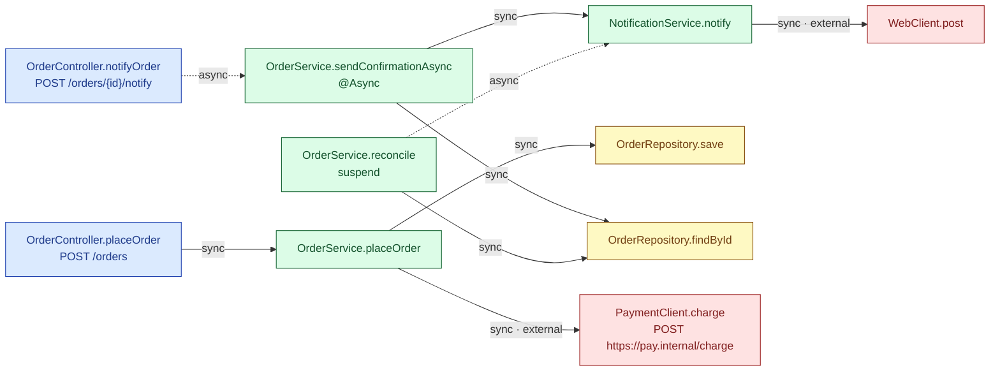
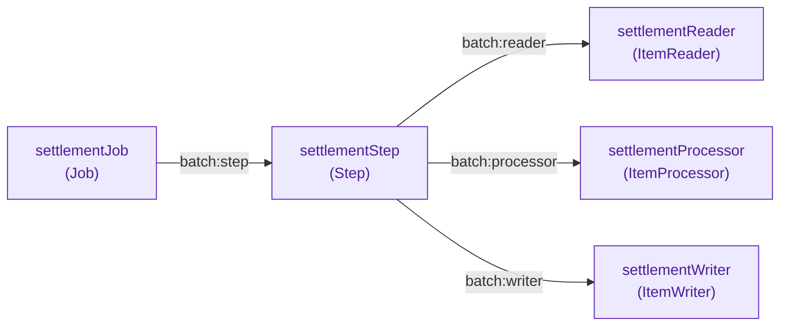
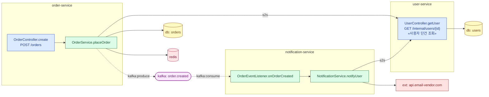

# flowmap-spring-kotlin

Spring **Kotlin/Java** 프로젝트를 정적 분석해서, 메서드 사이의 **호출/피호출 흐름**을
**node-link 그래프(`nodes[] + edges[]`) JSON**으로 뽑아내는 도구입니다.
특정 API/메서드를 지정하면 **BFS**로 그 대상의 호출(downstream)·피호출(upstream)
서브그래프를 추출합니다.

분석 결과에는:

- **레이어**: Controller / Service / Repository / Component / Config / Batch / External
- **동기 · 비동기 구분**: `suspend`, `@Async`/`@Scheduled`, reactive 반환(`Mono`/`Flux`/…),
  코루틴 빌더(`launch`/`async`/`withContext`/…) 안에서의 호출
- **컨트롤러 엔드포인트**: HTTP 메서드 + 전체 URL 경로(클래스 `@RequestMapping` + 메서드 매핑)
- **스프링 배치 관계**: Job → Step → Reader / Processor / Writer / Tasklet
- **외부 API 호출**: `@FeignClient` / `@HttpExchange` / `RestTemplate` / `WebClient`,
  그리고 대상 **URL · HTTP 메서드 · 외부 서비스(패키지 포함)**
- **코드 위치**: 노드의 선언 위치(`file:line`), 엣지의 호출 지점(`callSiteFile:callSiteLine`)

이 정보로 컨트롤러→서비스→리포지토리/외부 같은 **호출 경로**를 그래프 탐색으로 복원할 수 있습니다.

---

## 예시 다이어그램 (`.repo/sample-shop`)

아래는 번들된 데모 프로젝트를 실제로 분석한 결과입니다(`analyze --project sample-shop`).
색 = 레이어, **점선 = 비동기(async)** 호출, `external` 라벨 = 외부 API 호출.



읽는 포인트: `notifyOrder→sendConfirmationAsync`는 `@Async`라 **비동기(점선)**, `reconcile→notify`는
`launch{}` 안이라 비동기이지만 같은 `notify`를 일반 호출하는 `sendConfirmationAsync→notify`는 동기.
`PaymentClient`(`@FeignClient`)는 외부 URL까지 해석되고, `WebClient.post`는 런타임 URL이라 미해석.

스프링 배치 와이어링(`@Configuration @EnableBatchProcessing`)도 별도 엣지로 표현됩니다:



> 특정 API만 보고 싶으면 `search`로 해당 메서드의 BFS 서브그래프를 뽑아 같은 식으로 그릴 수 있습니다.

### MSA 예시 — 서버 간 호출(S2S) · Kafka 이벤트 · DB/Redis

`order-service` / `user-service` / `notification-service`(데모)를 **각각 따로** 분석한
결과입니다. 한 서비스의 Feign 호출이 다른 분석된 서비스의 엔드포인트와 매칭되면 `external`이
아니라 **그 서비스로(`s2s`)** 이어지고, Kafka는 `producer → topic → consumer`로,
DB/Redis는 공유 리소스 노드로 표현됩니다. (점선 = 비동기/이벤트)



핵심: `order-service`와 `notification-service`가 **각각 따로 분석돼도** 둘 다
`user-service.getUser`로 S2S 연결되고, `order-service`가 발행한 `order.created` 이벤트가
`notification-service`로 이어집니다(크로스-런 레지스트리). REST Docs가 있으면 엔드포인트에
한글 설명(`«사용자 단건 조회»`)까지 붙습니다. 자세한 사용법은 [`MANUAL.md`](MANUAL.md)의 "MSA" 절 참고.

---

## 분석기

분석기는 이 저장소 **루트의 독립 Gradle 프로젝트**입니다. Kotlin 컴파일러 K1
프론트엔드(PSI + BindingContext)로 의미 분석을 하기 때문에 상수/`object`/`@Value`/`${...}`
참조를 따라가 **외부 API 실제 URL까지 정확히** 해석하고, 호출 해석도 심볼 기반(오버로드·
확장함수·암시적 receiver)으로 정확합니다. 분석 대상 소스는 `.repo/`에 둡니다.

> 과거의 Python 휴리스틱 구현(`callgraph/`)과 초기 ASM 바이트코드 버전은 제거됐습니다.

### 명령 한눈에

모든 산출물의 **공통 키는 node id(`<fqcn>#<method>`)** 라서 그래프·API 문서·영향도가 서로 조인됩니다.

| 명령 | 입력 | 산출 | 용도 |
|---|---|---|---|
| **`refresh`** | `.repo`(git) | **위 산출물 일괄 + impact** | **pull + 전 프로젝트 분석/openapi/impact/combine/manifest 한 방에 (권장)** |
| `analyze` | repo 소스(+`--restdocs`) | node-link 콜그래프 JSON | 단일 서비스 호출/외부호출/리소스 그래프 |
| `openapi` | repo 소스(+`--restdocs`) | OpenAPI 3.1 JSON | 요청/응답 스키마 → Redoc/Scalar 웹문서 |
| `impact` | git repo + 그래프 | 커밋별 변경 영향도 JSON | 커밋 변경 → 메서드 → 영향 엔드포인트/서비스 |
| `combine` | 서비스별 그래프들 | 통합 그래프(S2S/이벤트) | 서비스 간 호출·Kafka·DB 결합 |
| `search`/`stats` | 그래프 | 서브그래프 / 요약 | 특정 메서드 BFS, 통계 |

---

## 빠른 시작

```bash
./gradlew build

# ── 설정 파일로 한 방에 (권장) ─────────────────────────────────────
# flowmap.config 를 만들어 두면 인자 없이 ./gradlew run 만으로 실행됩니다.
#   cp flowmap.config.example flowmap.config   # 그리고 REPO/OUT_DIR 수정
./gradlew run
# flowmap.config (KEY=VALUE, # 주석, ${VAR} 치환 지원):
#   COMMAND=refresh                 # 실행할 명령 (기본 refresh)
#   REPO=.repo                      # 분석 repo 루트   -> --repo
#   OUT_DIR=../flowmap5/docs/web/data   # 출력 위치     -> --out-dir
#   EXTRA_ARGS=--no-pull --no-impact    # 추가 플래그(그대로 전달)

# ── 인자를 직접 주는 방식 ───────────────────────────────────────────
# .repo의 모든 프로젝트를 최신화(pull)한 뒤, 가능한 모든 분석을 한 번에:
#   호출그래프 + OpenAPI + RestDocs 보강 + 커밋(impact) + combine(게이트웨이 자동발견) + manifest
# 기본 --repo 는 .repo, 기본 --out-dir 는 ./json
./gradlew run --args="refresh"
./gradlew run --args="refresh --no-pull"          # pull 없이 재분석만
./gradlew run --args="refresh --no-impact"        # 커밋 분석 생략

# ── 개별 분석 (디버깅/단발성) ───────────────────────────────────────
./gradlew run --args="analyze --project sample-shop --out /tmp/shop.json"
./gradlew run --args="search --method placeOrder --graph /tmp/shop.json --direction both"
```

자세한 옵션/스키마/설계는 [`MANUAL.md`](MANUAL.md)를 보세요.

---

## 분석 대상 레이아웃

분석할 프로젝트는 `.repo/` 아래에 둡니다:

```
.repo/<프로젝트명>/<모듈명>/.../*.kt | *.java
```

각 노드에는 어느 `project`/`module`에서 왔는지 함께 기록됩니다.

이 저장소에는 데모용 샘플만 포함되어 있습니다:
- **`.repo/sample-shop/`** — 단일 서비스 데모(controller→service→repository, 동기/비동기, `@FeignClient`/`WebClient`, 스프링 배치)
- **`.repo/order-service`·`user-service`·`notification-service`** — MSA 데모(서버 간 S2S 호출, Kafka 이벤트, Redis/DB, REST Docs 설명)

분석하려는 실제 프로젝트는 `.repo/<your-project>/`에 넣으면 됩니다. `.gitignore`가
이 데모들 외의 `.repo/*`, 그리고 **분석 산출물**(`graph.json` 등)을
**커밋에서 제외**합니다 — 사내/외부 소스나 결과물이 실수로 공개되지 않도록.
(분석기 산출물은 `./json/`에 쌓입니다.)

---

## 출력 스키마 (node-link)

```jsonc
{
  "directed": true, "multigraph": true, "meta": { ... },
  "nodes": [
    { "id": "com.shop.order.OrderService#placeOrder",
      "fqcn": "com.shop.order.OrderService", "method": "placeOrder",
      "layer": "SERVICE", "visibility": "public", "async": false,
      "returnType": "Order",
      "httpMethod": null, "endpoint": null,         // 컨트롤러/외부 노드에서 채워짐
      "externalService": null, "externalUrl": null, // 외부 노드에서 채워짐
      "file": "sample-shop/order-api/.../OrderService.kt", "line": 14,
      "project": "sample-shop", "module": "order-api" }
  ],
  "edges": [
    { "source": "...#placeOrder", "target": "...#save",
      "mode": "sync",        // sync | async
      "kind": "internal",    // internal | external | s2s | batch | resource
      "relation": "call",    // call | batch:* | kafka:produce | kafka:consume | redis:io | db:io
      "callSiteFile": "...", "callSiteLine": 16 }
  ]
}
```

노드에는 이 외에 `resourceType`(Kafka/Redis/DB 노드), `description`(API 한글 설명) 키가
있고, MSA/S2S·Kafka·DB·Redis·레지스트리(`.flowmap/registry.json`) 산출물까지 포함한
**전체 스키마는 [`MANUAL.md`](MANUAL.md)의 "산출물 스키마 (상세)"** 절에 정리돼 있습니다.
분석기는 외부 노드에 추가로 `urlPlaceholder`(원본 `${...}`)·`clientPackage`를 채웁니다.

---

## 디렉토리 구조

```
flowmap-spring-kotlin/          # 분석기 = 이 저장소 루트 (kotlin-compiler-embeddable, K1 프론트엔드)
├── build.gradle.kts            # 분석기 Gradle 프로젝트
├── settings.gradle.kts
├── src/main/kotlin/com/flowmap/callgraph/   # 분석기 소스
├── MANUAL.md                   # 명령별 옵션 · 출력 스키마 · 웹 연동 상세
├── json/                       # refresh 산출물 (gitignored)
└── .repo/<프로젝트>/           # 분석 대상 소스 (sample-shop 등 데모 번들)
```

## 라이선스

내부 학습/도구용. (필요 시 라이선스 추가)
